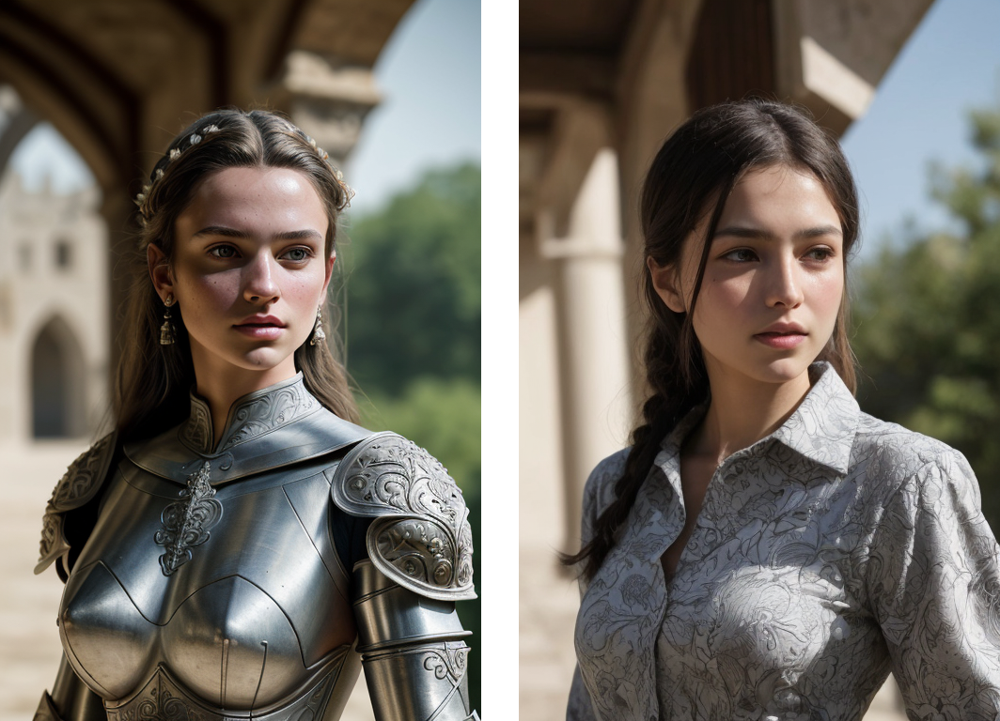
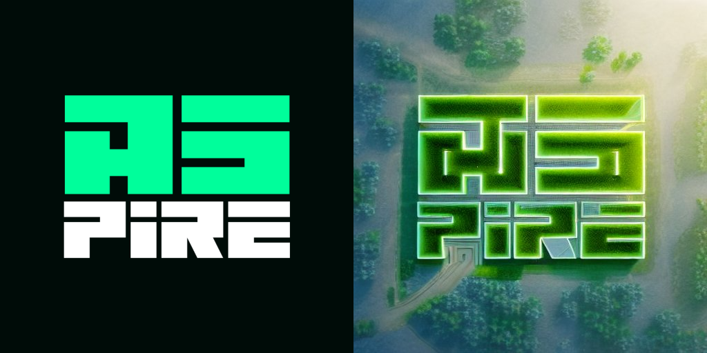

# ___About___
**Prodia.js** is a simple wrapper for the [Prodia API](https://prodia.com/) with latest features.

# ___Installation___
```
npm install prodia.js
```

# ___Features___
- Create a image from text
- Transform an existing image
- Create a Controlnet generation
- Create an SDXL generation

# ___Usage___
#### ___1. Text to Image___
Generate an image from text. Get your api key from [here](https://prodia.com/).

```js
(async () => {
    const { Prodia } = require("prodia.js");

    const prodia = new Prodia("xxxxxxxx-xxxx-xxxx-xxxx-xxxxxxxxxxxx"); // your api key

    const generate = await prodia.generateImage({
        prompt: "cat",
        model: "absolutereality_V16.safetensors [37db0fc3]"
    })

    while (generate.status !== "succeeded" && generate.status !== "failed") {
        new Promise((resolve) => setTimeout(resolve, 250));

        const job = await prodia.getJob(generate.job);

        if (job.status === "succeeded") {
            console.log(job);
            break;
        }
    }
})()
```


#### ___2. Image to Image___
Transform an existing image.

```js
(async () => {
    const { Prodia } = require("prodia.js");

    const prodia = new Prodia("xxxxxxxx-xxxx-xxxx-xxxx-xxxxxxxxxxxx");

    const generate = await prodia.transformImage({
        imageUrl: "https://images.prodia.xyz/3e3b03aa-93c1-4fad-8263-0ff78ac49257.png",
        prompt: "A painting of a dog sitting on a chair",
        model: "absolutereality_V16.safetensors [37db0fc3]"
    })

    while (generate.status !== "succeeded" && generate.status !== "failed") {
        new Promise((resolve) => setTimeout(resolve, 250));

        const job = await prodia.getJob(generate.job);

        if (job.status === "succeeded") {
            console.log(job);
            break;
        }
    }
})()
```


#### ___3. Controlnet Generation___
Create a Controlnet generation.

```js
(async () => {
    const { Prodia } = require("prodia.js");

    const prodia = new Prodia("xxxxxxxx-xxxx-xxxx-xxxx-xxxxxxxxxxxx");

    const generate = await prodia.controlNet({
        imageUrl: "https://media.discordapp.net/attachments/1120977879564562503/1147508591499165726/A3PIRE.jpg",
        cfgScale: 9,
        prompt: "top view of nature futuristic city",
        cnModel: "control_v11p_sd15_canny [d14c016b]",
        cnModule: "canny",
        sampler: "DDIM",

    })

    while (generate.status !== "succeeded" && generate.status !== "failed") {
        new Promise((resolve) => setTimeout(resolve, 250));

        const job = await prodia.getJob(generate.job);

        if (job.status === "succeeded") {
            console.log(job);
            break;
        }
    }
})()
```


#### ___4. SDXL Generation___
Create an SDXL generation.

```js
(async () => {
    const { Prodia } = require("prodia.js");

    const prodia = new Prodia("xxxxxxxx-xxxx-xxxx-xxxx-xxxxxxxxxxxx");

    const generate = await prodia.sdxl({
        prompt: "breathtaking night street of Tokyo, neon lights. award-winning, professional, highly detailed",
        model: "dreamshaperXL10_alpha2.safetensors [c8afe2ef]"
    })

    while (generate.status !== "succeeded" && generate.status !== "failed") {
        new Promise((resolve) => setTimeout(resolve, 250));

        const job = await prodia.getJob(generate.job);

        if (job.status === "succeeded") {
            console.log(job);
            break;
        }
    }
})()
```


# License
This project is licensed under the MIT License - see the [LICENSE](https://github.com/A3PIRE/prodia.js/blob/main/license) file for details